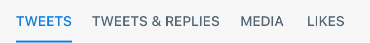

    

A collection of real world-esque replica **Tabman** styles.

## Installation

Clone the repo, run `pod install` and open the workspace. 🍻

## Styles
The following styles are available currently:

### Twitter

    

A reproduction of the Tweet filter bar available in the 'Me' tab of the official Twitter app; which made an appearance in 2017.

## Requests
To request a style, please feel free to raise an [issue](https://github.com/YorkUI/Tabman-Styles/issues/new).

## Contributing
New styles or any other nice features are welcome via pull request on GitHub at [https://github.com/YorkUI/Tabman-Styles](https://github.com/YorkUI/Tabman-Styles).

## License
The library is available as open source under the terms of the [MIT License](http://opensource.org/licenses/MIT).

